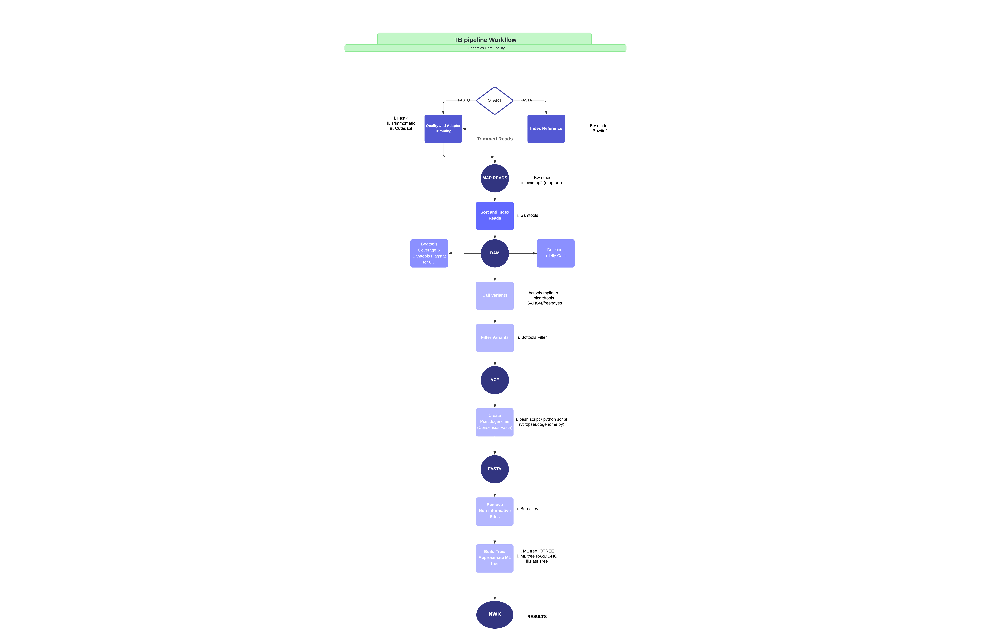

<h1 align="center"> GCF Bact Pipeline</h1>


# Workflow



### Getting Started  

```bash
  git clone https://github.com/iamamofa/GCF_Bact.git
```

```bash
  cd GCF_Bact
```
#### sets conda packages and other important ones
```bash
  bash install_prerequisites.sh
```

```bash
  bash package_manager.sh
```

